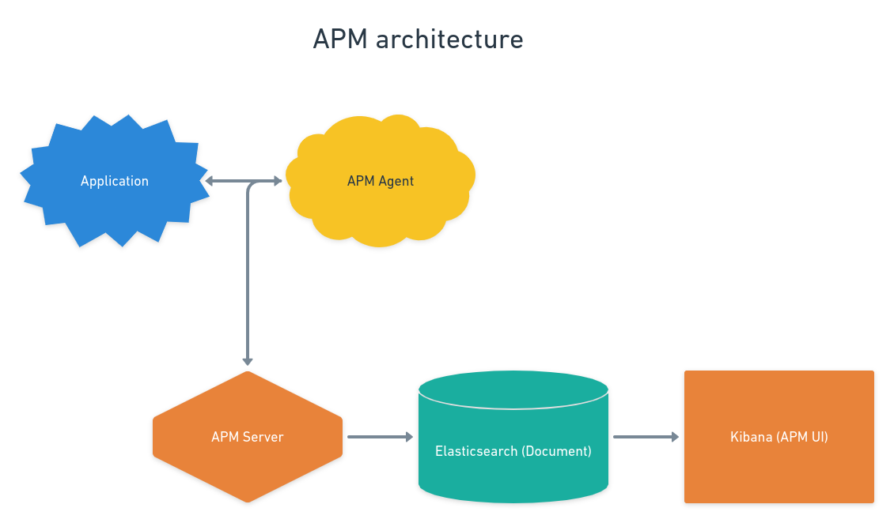

# Observabilidade com APM
```
Elastic APM permite observar/monitorar aplicativos em tempo real, coletando métricas de desempenho detalhadas sobre o tempo de resposta para solicitações de entrada, consultas de banco de dados, solicitações de HTTP externas, etc...
```
________________________________________________________

### Sequência de comandos para rodar o projeto:
- Se o nome do repositório é `tech-day-observability` então as networks devem ter esse prefixo
- Como o nome do repositório é `tech-day-apm` então as networks devem ter esse prefixo

```shell script
$ docker-compose -f apm-compose.yaml up # Levantar a Stack do APM

$ docker inspect <ID CONTAINER APM SERVER> # Comando para ver o IPAddress do APM Server

$ docker-compose -f server-compose.yaml up # Levantar o server
$ docker-compose -f web-compose.yaml up # Levantar o web
```
- Obs.: Demora um pouco para rodar a primeira vez.
- Atenção.: Não se esqueça de obter o IP do APM Server e alterar nos arquivos `server/config/server.js` e `web/src/index.tsx`

________________________________________________________

| Serviço  |  Porta          |
| -------- | --------------- |
|  APM     |  localhost:8200 |
|  Kibana  |  localhost:5601 |
|  Server  |  localhost:1337 |
|  Web     |  localhost:3000 |

________________________________________________________



## Elastic APM tem dois componentes:

##### APM Agents
> Os "agentes do APM" é configurado no código da aplicação e coletam dados de desempenho e erros em tempo de execução. 
> Os dados são armazenados em buffer por um curto período de tempo, após o qual são enviados ao "servidor APM". 
> Os "agentes do APM" são escritos na mesma linguagem de programação da nossa aplicação.


##### APM Server
> O "servidor APM" é um aplicativo de código aberto escrito em GO.
> Seu objetivo é receber dados de agentes APM, transformá-los em "documentos do Elasticsearch" e enviá-los ao Elasticsearch.
> Isso é realizado usando uma API JSON HTTP. (Se deixar o log do compose conseguimos ver as requests)


- Uma vez que as métricas são armazenadas no Elasticsearch, você pode monitorar o desempenho do seu aplicativo usando os painéis APM integrados do Kibana, que podem ser encontrados na guia "APM".

________________________________________________________
### Elasticsearch
> O Elasticsearch é um mecanismo de busca e análise de dados distribuído e open source para todos os tipos de dados, incluindo textuais, numéricos, geoespaciais, estruturados e não estruturados.


### Kibana:
> O Kibana é uma ferramenta de visualização e gerenciamento de dados para o Elasticsearch que fornece histogramas e dashboards em tempo real, gráficos de linhas, gráficos de pizza e mapas.
> O Kibana também inclui aplicações avançadas como o Canvas, que permite aos usuários criar infográficos dinâmicos personalizados com base em seus dados, e o Elastic Maps para visualizar dados geoespaciais.

________________________________________________________

### Lista de tarefas
- [x] Implementar docker para o Elastic APM .
- [x] Implementar o APM no Strapi.
- [x] Implementar o APM no React.
- [x] Implementar a Arquitetura do APM no Whimsical.
- [x] Implementar docker para o `web/`.
- [ ] Copiar tudo aqui e jogar no repositório correto.
- [ ] Retirar anotação citada sobre networks na parte de comandos para rodar o projeto após trocar o repositório para o correto.


#### Principais ferramentas utilizadas
1. Strapi (Node.js).
2. React.js.
3. Typescript.
4. Docker.

#### Links Importantes:
- [Onde foi tirado o compose do APM.](https://www.elastic.co/guide/en/apm/get-started/current/quick-start-overview.html)
- [Onde foi tirado o passo a passo e código de configuração do APM.](https://www.elastic.co/apm)
- [Arquitetura do APM no Whimsical.](https://whimsical.com/apm-VNhrSxso5qC9bHkjJoHEvJ)